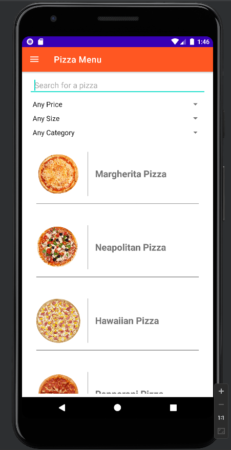

# Pizza Restaurant Android Application

## Project Description

Android application for a pizza restaurant to facilitate online pizza ordering. The application aims to provide a user-friendly and straightforward experience. Here's a breakdown of the required functionalities:

### 1. Introduction Layout

This layout features a "Get Started" button that connects to a server using REST to load the available pizza types. The application handles the connection status as follows:

- **Successful Connection:**
  - Users are directed to the login and registration section.

- **Connection Failure:**
  - An error message is displayed, allowing users to retry the connection.

### 2. Login and Registration Layout

This layout includes "Login" and "Sign Up" buttons, each redirecting to specific pages. The login functionality includes a "remember me" checkbox to save the email in shared preferences for future logins. The sign-up process enforces various validation criteria for user input.

### 3. Home Layout (Sign in as Normal Customer)

This layout, a Navigation Drawer Activity, offers various functionalities:

- **Home:** Displays the restaurant's history.
- **Pizza Menu:** Lists all pizza types with the ability to view details, add to favorites, and place orders.
- **Your Orders:** Shows past orders with order details.
- **Your Favorites:** Displays user's favorite pizzas with ordering functionality and undo-favorite option.
- **Special Offers:** Lists special offers with ordering functionality.
- **Profile:** Allows users to view and edit personal information.
- **Call Us or Find Us:** Provides options to call, find the restaurant on Google Maps, and send an email.
- **Logout:** Logs out the user and redirects to the login page.

### 4. Home Layout (Sign in as Admin)

Similar to the customer layout but with additional functionalities for admins:

- **Admin Profile:** Allows admins to view and edit personal information.
- **Add Admin:** Enables adding new admins with validation criteria.
- **View All Orders:** Displays all orders with details.
- **Add Special Offers:** Allows admins to add new special offers with customizable parameters.
- **Logout:** Logs out the admin and redirects to the login page.

### 5. Extra Features

- **Adding a Profile Picture for the Customer:** Allows customers to set and change their profile picture.
- **Admin Features:** Enables admins to calculate order statistics and total income for each pizza type.

## Gallery

### Initial Photo

  
Click to show all photos

  ### Screen1
  

  ### Screen2
  

  ### Screen3
  

  ### Screen4
  

  ### Screen5
  

  ### Screen6
  

  ### Screen7
  

  ### Screen8
  

## How to Run

- Clone the repository to your local machine.
- Ensure Android Studio is installed.
- Run the project.

## Languages And Tools:

-  
